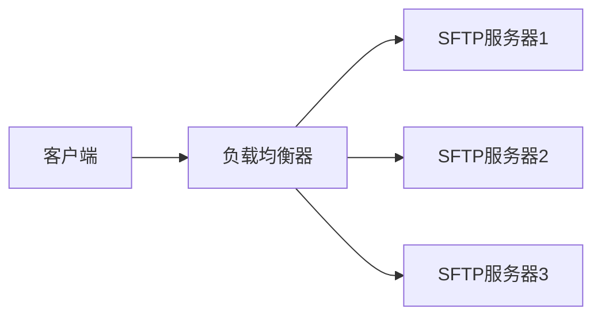
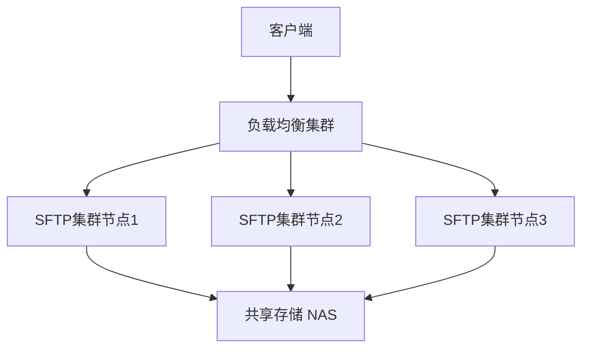

# SFTP 的多IP支持能力深度解析

SFTP（SSH File Transfer Protocol）协议本身**不直接支持多IP能力**，因为它是基于SSH的单连接协议。但我们可以通过多种技术方案实现类似功能，提升系统的可用性和性能。

## 一、SFTP 协议的多IP限制

### 协议层限制：
- **单连接特性**：每个SFTP会话建立在单个SSH连接上
- **无内置负载均衡**：协议未定义多IP处理机制
- **状态保持要求**：文件传输需要保持连接状态

## 二、实现多IP支持的解决方案

### 方案1：客户端多IP重试（推荐）

```java
import com.jcraft.jsch.*;

public class SftpMultiIPClient {
    private static final String[] SFTP_SERVERS = {
        "192.168.1.10",
        "192.168.1.11",
        "192.168.1.12"
    };
    private static final int PORT = 22;
    private static final String USER = "username";
    private static final String PRIVATE_KEY = "/path/to/private_key";

    public void downloadFile(String remotePath, String localPath) {
        JSch jsch = new JSch();
        Session session = null;
        ChannelSftp channel = null;
        
        for (String host : SFTP_SERVERS) {
            try {
                // 1. 添加私钥
                jsch.addIdentity(PRIVATE_KEY);
                
                // 2. 创建会话
                session = jsch.getSession(USER, host, PORT);
                session.setConfig("StrictHostKeyChecking", "no");
                
                // 3. 设置超时和重试
                session.setTimeout(3000);
                session.connect(5000); // 5秒连接超时
                
                // 4. 创建SFTP通道
                channel = (ChannelSftp) session.openChannel("sftp");
                channel.connect(3000);
                
                // 5. 执行文件传输
                channel.get(remotePath, localPath);
                System.out.println("成功从 " + host + " 下载文件");
                return; // 成功则退出
                
            } catch (JSchException | SftpException e) {
                System.err.println("服务器 " + host + " 连接失败: " + e.getMessage());
            } finally {
                // 6. 关闭连接
                if (channel != null) channel.disconnect();
                if (session != null) session.disconnect();
            }
        }
        throw new RuntimeException("所有SFTP服务器均不可用");
    }

    public static void main(String[] args) {
        new SftpMultiIPClient().downloadFile("/remote/file.txt", "local.txt");
    }
}
```

### 方案2：负载均衡器（L4层）



**配置示例（HAProxy）**：
```conf
frontend sftp_front
    bind *:22
    mode tcp
    default_backend sftp_back

backend sftp_back
    mode tcp
    balance roundrobin
    server sftp1 192.168.1.10:22 check
    server sftp2 192.168.1.11:22 check
    server sftp3 192.168.1.12:22 check
```

### 方案3：DNS轮询

```bash
# DNS配置示例（A记录）
sftp.example.com. IN A 192.168.1.10
sftp.example.com. IN A 192.168.1.11
sftp.example.com. IN A 192.168.1.12
```

### 方案4：智能客户端（高级）

```java
public class SmartSftpClient {
    private final Map<String, ServerStats> serverStats = new ConcurrentHashMap<>();
    
    public void downloadFile(String remotePath, String localPath) {
        List<String> servers = getOptimalServers();
        
        for (String host : servers) {
            long start = System.currentTimeMillis();
            try {
                // 连接并下载...
                long duration = System.currentTimeMillis() - start;
                updateStats(host, true, duration);
                return;
            } catch (Exception e) {
                updateStats(host, false, 0);
            }
        }
    }
    
    private List<String> getOptimalServers() {
        // 基于响应时间、错误率等排序服务器
        return serverStats.entrySet().stream()
            .sorted((e1, e2) -> 
                Float.compare(e1.getValue().successRate(), e2.getValue().successRate()))
            .map(Map.Entry::getKey)
            .collect(Collectors.toList());
    }
    
    private void updateStats(String host, boolean success, long responseTime) {
        serverStats.computeIfAbsent(host, k -> new ServerStats())
                  .update(success, responseTime);
    }
    
    static class ServerStats {
        int successCount = 0;
        int failureCount = 0;
        long totalResponseTime = 0;
        
        void update(boolean success, long responseTime) {
            if (success) {
                successCount++;
                totalResponseTime += responseTime;
            } else {
                failureCount++;
            }
        }
        
        float successRate() {
            int total = successCount + failureCount;
            return total > 0 ? (float) successCount / total : 0;
        }
        
        long avgResponseTime() {
            return successCount > 0 ? totalResponseTime / successCount : Long.MAX_VALUE;
        }
    }
}
```

## 三、多方案对比分析

| 方案 | 实现难度 | 可用性 | 性能 | 状态保持 | 适用场景 |
|------|----------|--------|------|----------|----------|
| **客户端重试** | ★★☆ | ★★★ | ★★★ | 无 | 中小型系统，客户端可控 |
| **负载均衡器** | ★★★ | ★★★ | ★★☆ | 支持（源IP哈希） | 企业级部署 |
| **DNS轮询** | ★☆☆ | ★★☆ | ★★☆ | 无 | 简单故障转移 |
| **智能客户端** | ★★★★ | ★★★★ | ★★★★ | 无 | 高性能关键系统 |

## 四、生产环境最佳实践

### 1. 文件同步策略
```bash
# 使用rsync保持多服务器文件一致
rsync -avz -e ssh /local/data/ user@sftp-server1:/remote/data/
rsync -avz -e ssh /local/data/ user@sftp-server2:/remote/data/
```

### 2. 服务器配置优化
```conf
# /etc/ssh/sshd_config
MaxSessions 100
MaxStartups 100
ClientAliveInterval 300
```

### 3. 高可用架构


### 4. 监控指标
```bash
# 关键监控项：
ssh_connections{server="sftp1"} 42
sftp_transfer_rate{server="sftp2"} 120.5 # MB/s
server_cpu_usage{server="sftp3"} 75.3 # %
```

## 五、协议扩展方案

### 1. SFTP-over-HTTPS
```
客户端 → [HTTP/S负载均衡器] → [SFTP网关集群] → 后端存储
```

### 2. 分布式文件系统接口
```java
// 统一文件访问接口
public interface DistributedSftp {
    InputStream readFile(String path) throws IOException;
    void writeFile(String path, InputStream data) throws IOException;
}

// MinIO实现
public class MinioSftpAdapter implements DistributedSftp {
    private final MinioClient minioClient;
    private final String bucket;
    
    public InputStream readFile(String path) {
        return minioClient.getObject(bucket, path);
    }
}
```

## 六、行业应用案例

### 金融行业解决方案
```
客户交易终端 → [F5负载均衡] → [SFTP集群] → [SAN存储]
                      │ │
                  [Prometheus监控] [审计日志系统]
```

### 云服务提供商架构
```
用户客户端 → [云负载均衡] → [SFTP网关] → [对象存储]
                    │ │
                [自动伸缩组] [密钥管理服务]
```

## 总结

虽然SFTP协议本身不直接支持多IP，但通过以下方式可实现高可用和高性能：
1. **客户端重试机制** - 简单高效，推荐首选
2. **负载均衡器** - 企业级解决方案
3. **智能客户端** - 最高性能选择
4. **分布式文件系统** - 终极扩展方案

实际选择需考虑：
- 系统规模（客户端/服务器数量）
- 可用性要求（SLA级别）
- 文件一致性需求
- 运维复杂度预算

对于关键业务系统，推荐采用"负载均衡器+智能客户端回退"的混合方案，在保证企业级可靠性的同时提供最佳用户体验。